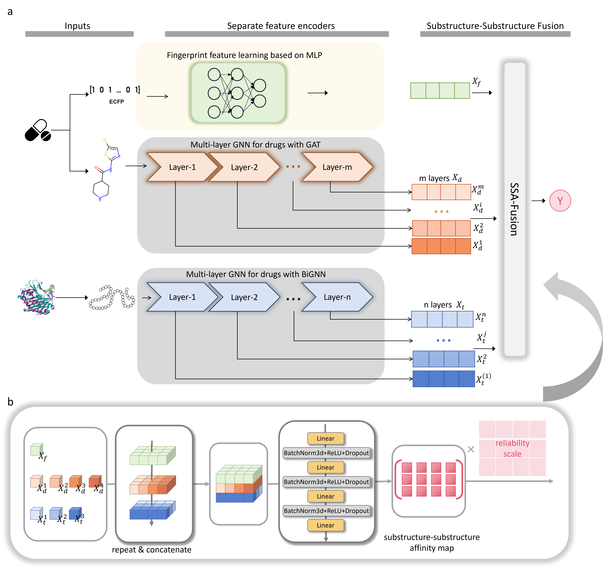

<h1 align="center">
<p> SSR-DTA: Substructure-aware multi-layer graph neural networks for drug-target binding affinity prediction</h1>

<p align="center"></p>

 ---

# Article


# Requirements

[requirements.txt](requirements.txt) 

- # Usage
1. Activate a python environment with requirements <br />

2. Clone the repository, navigate to the cloned folder <br />
   `git@github.com:Xinyan-Xia/SSR-DTA.git` <br />
   

3. Install required packages <br />
   `pip install wheel` <br />
   `pip install -r requirements.txt` <br />

4. Run the experiments <br />
   
   
   
   open models.ipynb and run
   
   
   The log will be saved in the `lightning_log/` folder <br />

5. You can change the params in models.ipynb <br />
   
   - for KIBA datasets, we use the params as follows:
     
     ```python
     param_dict={
      "chem_in_features": 23,
      "prot_in_features": 41,
       "hidden_dim" :256,
      "chem_heads_out_feat_params": [32, 32, 32, 32, 32, 32], 
     "chem_blocks_params": [8, 8, 8, 8, 8, 8],
     "dropout_1":0.2,
     "dropout_2":0.1,
     "prot_heads_out_feat_params": [32, 32, 32, 32, 32, 32], 
     "prot_blocks_params": [8, 8, 8, 8, 8, 8],
     "prot_windows_params": [7, 7, 7, 7, 7, 7],
     "batch_size": 512,
     "lr": 5e-4,
     "dataset_name": "KIBA",
     "criterion": nn.MSELoss(),
     "model_name":"ssr-dta",
     "T_max": 2000
     }
     ```
   
   - for Davis datasets, we use the params as follows:
     
     ```python
     param_dict={
      "chem_in_features": 23,
      "prot_in_features": 41,
       "hidden_dim" :256,
      "chem_heads_out_feat_params": [32, 32, 32, 32, 32, 32], 
     "chem_blocks_params": [8, 8, 8, 8, 8, 8],
     "dropout_1":0.2,
     "dropout_2":0.1,
     "prot_heads_out_feat_params": [32, 32, 32, 32], 
     "prot_blocks_params": [8, 8, 8, 8],
     "prot_windows_params": [7, 7, 7, 7],
     "batch_size": 512,
     "lr": 5e-4,
     "dataset_name": "KIBA",
     "criterion": nn.MSELoss(),
     "model_name":"ssr-dta",
     "T_max": 2000
     }
     ```
   
   # Data
   
   - Atomic-level graph features for ligand representation
     
     | Node features                                                | Size |
     | ------------------------------------------------------------ | ---- |
     | One-hot encoded atom type (C, N, O, F, S, Cl, Br, P, I)      | 9    |
     | Atom mass (scaled by min–max)                                | 1    |
     | Number of directly bonded atom neighbours (scaled by minmax) | 1    |
     | Total number of bonded hydrogens (scaled by min–max)         | 1    |
     | One-hot encoded atom hybridization (sp2,sp3)                 | 2    |
     | Is atom in a ring (1 – yes, 0 – no)                          | 1    |
     | Is atom aromatic (1 – yes, 0 – no)                           | 1    |
     | Is atom hydrophobic (1 – yes, 0 – no)                        | 1    |
     | Is atom metal (1 – yes, 0 – no)                              | 1    |
     | Is atom halogen (1 – yes, 0 – no)                            | 1    |
     | Is atom donor (1 – yes, 0 – no)                              | 1    |
     | Is atom acceptor (1 – yes, 0 – no)                           | 1    |
     | Is atom positively charged (1 – yes, 0 – no)                 | 1    |
     | Is atom negatively charged (1 – yes, 0 – no)                 | 1    |
     | Totall                                                       | 23   |
   
   - Residue-level node features for protein graph representation
     
     | Node features                                                                                                                | Size |
     | ---------------------------------------------------------------------------------------------------------------------------- | ---- |
     | Solvent-accessible surface area (scaled by mean and standard deviation)                                                      | 1    |
     | Phi angle (in degrees, divided by 180)                                                                                       | 1    |
     | Psi angle (in degrees, divided by 180)                                                                                       | 1    |
     | One-hot encoded belonging to secondary structure (alpha helix, isolated beta-bridge residue, strand, 3–10 helix, turn, bend) | 6    |
     | AAPHY7 descriptors of a residue                                                                                              | 7    |
     | BLOSUM62 descriptors of a residue                                                                                            | 23   |
     | Phosphorylated (1 – yes, 0 – no, same for all nodes)                                                                         | 1    |
     | Mutated (1 – yes, 0 – no, same for all nodes)                                                                                | 1    |
     | Totall                                                                                                                       | 41   |
   
   # Notes
- It is recommended to use GPU to speed up the experiments 
- The default parameter is to run on the A40(48G) GPU. If you want to run on a smaller memory GPU, you can adjust the batch size appropriately.
